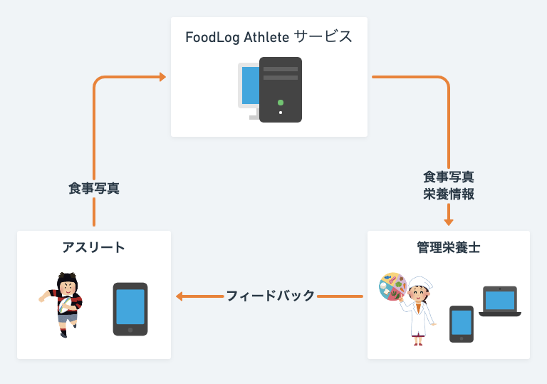
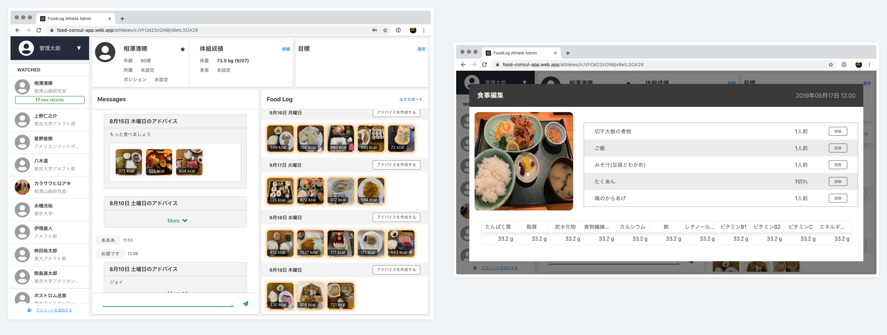
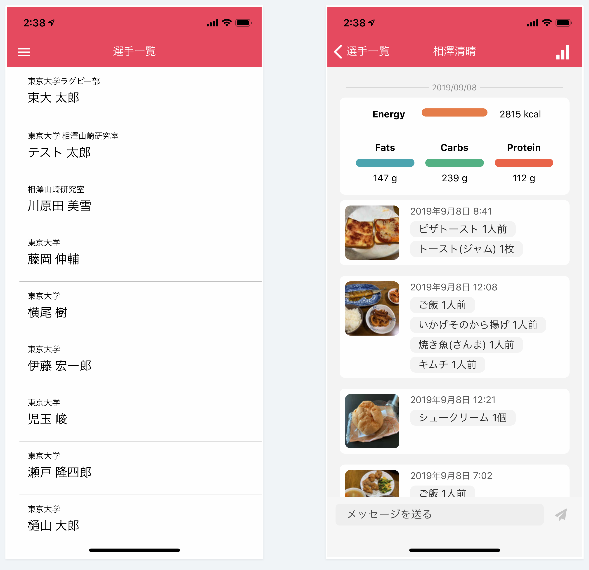
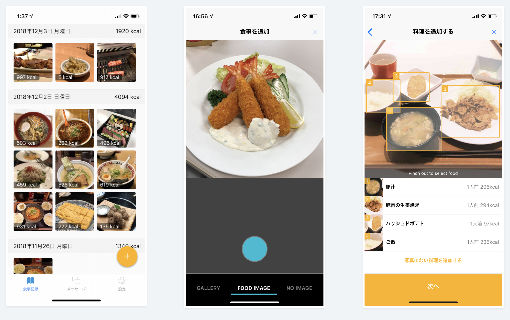

# FoodLog Athlete

## それぞれのアプリの使い方はこちら

- [管理栄養士 Web](https://food-consul-app.web.app)
- [アスリート向けアプリ(iOS)](https://itunes.apple.com/jp/app/food-consul-app/id1445567985?mt=8)
- [アスリート向けアプリ(Android)](https://play.google.com/store/apps/details?id=karszawa.foodLogAthlForDietitians.app)
- [管理栄養士向けアプリ(iOS)](https://apps.apple.com/us/app/foodlog-athl-for-dietitians/id1476571781)
- [管理栄養士向けアプリ(Android)](https://play.google.com/store/apps/details?id=me.foologathl.app)

## FoodLog Athlete とは

**FoodLog Athlete** はアスリートと管理栄養士がコミュニケーションをとるためのアプリケーションです。
アスリートはこのアプリケーションを使用して食事の記録を取ることで管理栄養士から食事に関するフィードバックを受けることができます。

食事記録の作成方法は簡単です。 食事の写真を撮影するだけで料理の名前と分量が自動で入力されるからです。 写真を撮影していなかった場合は料理をデータベースから検索できます。 更に、コンビニエンスストアで購入した製品などの場合はカメラでバーコードを読み取ることで情報を入力できます。

## 3 つのアプリケーション

FoodLog Athlete は管理栄養士とアスリートに向けて 3 つのアプリケーションを提供しています。

### 管理栄養士向け Web アプリケーション

管理栄養士向けの Web アプリケーションにはこちらの URL からアクセスできます。

[https://food-consul-app.web.app](https://food-consul-app.web.app)

このアプリケーションでは主に次の機能を利用できます。

- 数人〜数十人のアスリートの情報（氏名・年齢・目的等）を参照できる
- アスリートの食事画像を見ながらコメントを入力できる
- コメントと食事をまとめてレポートを作成できる
- 選手の体組成値の変化を参照できる
- 選手からの食事画像・メッセージが来たときに通知を受け取ることができる

更に詳しい使い方は[FoodLog Athlete の使い方（管理栄養士向け）](https://food-log.github.io/monster/usage-for-dietitians)をご参照下さい。

### 管理栄養士向けモバイルアプリケーション（iOS・Android）

管理栄養士向けのモバイルアプリケーションはこちらのリンクからダウンロードできます。

[App Store からダウンロード](https://apps.apple.com/us/app/foodlog-athl-for-dietitians/id1476571781)
[Play Store からダウンロード](https://play.google.com/store/apps/details?id=me.foologathl.app)

このアプリケーションでは主に次の機能を利用できます。

- 選手の食事記録の確認ができる
- 選手とのメッセージ機能が利用できる
- 選手の体組成値の変化を確認できる

### アスリート向けモバイルアプリケーション（iOS・Android）

アスリート向けモバイルアプリケーションはこちらのリンクからダウンロードできます。

[App Store からダウンロード](https://itunes.apple.com/jp/app/food-consul-app/id1445567985?mt=8)  
[Play Store からダウンロード](https://play.google.com/store/apps/details?id=me.foologathl.app)

このアプリケーションでは主に次の機能を利用できます。

- 食事の写真をアプリケーション内に記録できる
- 食事の写真を管理栄養士と共有できるその日に摂取したエネルギー・栄養素を計算・表示できる
- 管理栄養士からのコメントを表示することができる
- 管理栄養士にコメントすることができる

更に詳しい使い方は[FoodLog Athlete の使い方（アスリート向け）](https://food-log.github.io/monster/usage-for-athletes)をご参照下さい。

## 運営

本サービスは東京大学情報理工学系研究科相澤研究室の研究プロジェクトとして提供されています。
また、本サービスのシステムは[foo.log 株式会社](https://foo-log.co.jp/index.html)の協力により開発されています。
加えて食事栄養データは[株式会社 Eat Smart](https://www.eatsmart.co.jp/)から提供して頂いています。

## 利用規約

利用規約は[こちら](https://food-log.github.io/monster/terms-of-service)

## 利用料金

上述の通り、大学の研究プロジェクトとして運営されていますので、利用料金は発生しません。

## 連絡先

### 住所

〒 113-8656 　東京都文京区本郷 7-3-1 　工学部 2 号館
東京大学　大学院情報理工学系研究科 電子情報学専攻 相澤研究室

### メールアドレス

foodlog-hal@hal.t.u-tokyo.ac.jp
