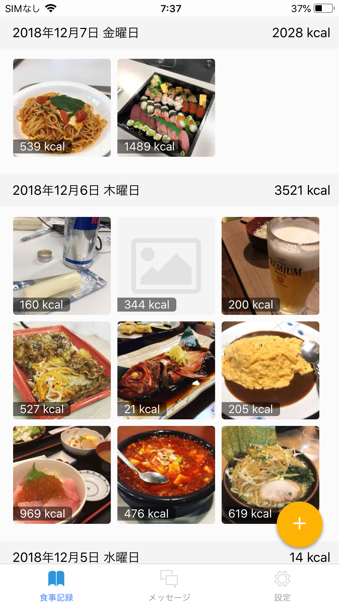
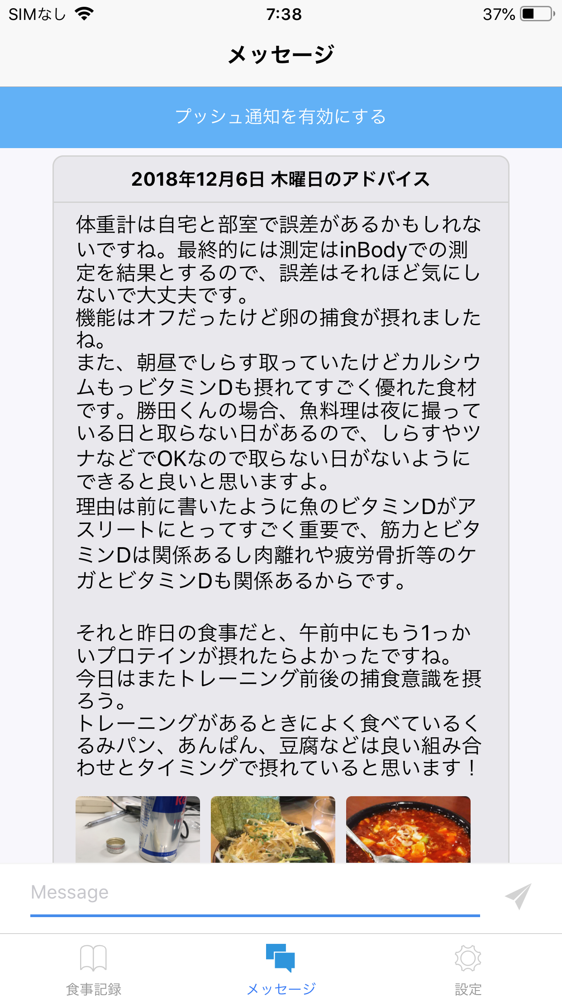
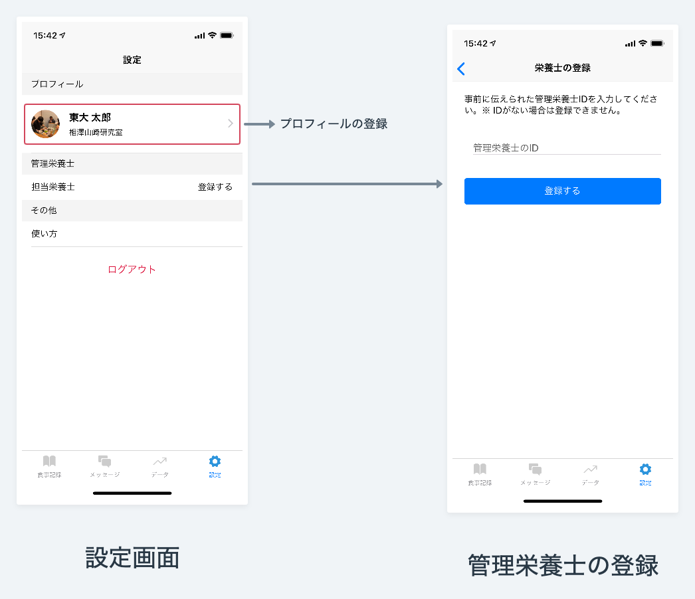
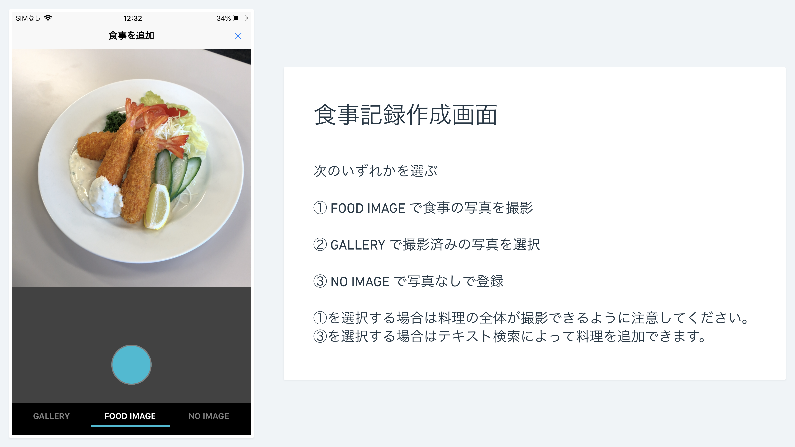
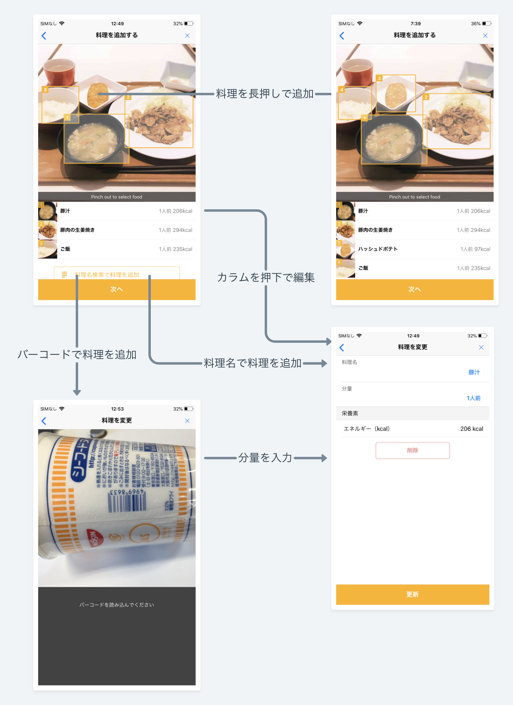

# FoodLog for Athletes v1.0.4

## FoodLog for Athletes とは

**FoodLog for Athletes** はアスリートと管理栄養士がコミュニケーションをとるためのアプリケーションです。
アスリートはこのアプリケーションを使用して食事の記録を取ることで管理栄養士から食事に関するフィードバックを受けることができます。

食事記録の作成方法は簡単です。
食事の写真を撮影するだけで料理の名前と分量が自動で入力されるからです。
写真を撮影していなかった場合は料理をデータベースから検索できます。
更に、コンビニエンスストアで購入した製品などの場合はカメラでバーコードを読み取ることで情報を入力できます。

この文章ではFoodLog for Athletesの機能を使用方法とともに説明します。

## 使用方法

### 1. アプリケーションのインストール

次のリンクからアプリケーションをインストールしてください。

[App Store からダウンロード](https://itunes.apple.com/jp/app/food-consul-app/id1445567985?mt=8)  
[Play Store からダウンロード](https://play.google.com/store/apps/details?id=me.foologathl.app)

### 2. アカウント登録

アプリケーションを起動するとサインイン画面が表示されます。
ここでは「新規会員登録はこちら」を押して会員登録画面を表示します。
次の画面でユーザー名とパスワードを入力し会員登録を完了してください。

#### 栄養士の追加

続いて管理栄養士の登録画面になります。
事前に管理栄養士から伝えられた管理栄養士IDがあればここで入力してください。
管理栄養士の登録は「設定」の画面からも可能です。

### 3. 食事記録一覧画面

サインインが正常に完了すると食事記録の一覧画面が表示されます。
ここでは過去に記録した食事を参照できます。
参照できる情報は「写真」・「写真ごとのカロリー」・「日ごとのカロリー」の3つだけとなっております。
他にもこういった情報を表示したいというご要望がございましたら
[フィードバック](https://goo.gl/forms/uBq5KjVD0dvpHe0H2)
よりご連絡くださると助かります。

### 4. メッセージ画面

ここで担当の管理栄養士とメッセージを送り合うことができ、更にフィードバックも表示されます。
担当の管理栄養士は管理栄養士が選手と登録することで決まります。

後述のプロフィールを入力しなければ管理栄養士が選手を見つけることができないので必ずそちらを入力してください。

### 5. 設定画面

ここでは名前・所属等の情報を入力したり管理栄養士を登録したりすることができます。
プロフィールを入力しないと**管理栄養士から選手を区別することができないので**、かならず入力しましょう。

#### プロフィールの入力

次のような値を入力してください

|      |                    |
| ---- | ------------------ |
| 姓   | 東大               |
| 名   | 太郎               |
| 所属 | 東京大学ラグビー部 |

#### 管理栄養士の登録

事前に管理栄養士から伝えられた管理栄養士IDを入力してください。

### 6. 食事記録作成

食事記録の作成は食事一覧画面の右下にあるプラスボタンから行います。

食事記録の作成は写真の撮影からはじまります。
写真は撮影しなくてもよく、その場合はカメラロールから選択するか「画像なし」を選択します。

### 7. 食事内容の確認

写真を選択して食事を記録する場合はここで写真内容の自動判定器が働き食事内容を自動で入力してくれます。
食事の内容が間違っていたり分量を変更したいときはその料理に対応するカラムを押すことで料理を編集できます。
画像中の食事の領域がおかしいときは四角い枠を移動させたり二本指で変形させることで再判定を行うことができます。
写真に写っている料理が認識されなかった場合は、料理の場所を長押しすることで新しい領域を認識させることができます。

### 8. 時刻・コメントの入力

食事内容を確認したら食事時刻とコメントを入力できる画面が表示されます。
食事記録を確認する管理栄養士にとって食事時刻と選手のコメントは非常に重要です。
食事時刻はデフォルトで投稿日時と同じ時刻が表示されていますが、実際に食事をとった時間が違う場合は変更しましょう。
コメントはその日の体調や睡眠量・トレーニング内容を入力しましょう。
特にウェイトトレーニングをした日は必ずそのことを記入しましょう。

以上の工程で食事記録の完了です。

## 目的

FoodLog for Athletes は東京大学工学部電子情報工学科相澤山崎研究室によって開発・運営されているサービスで、
食事記録の自動化によって選手と管理栄養士双方の入力の手間が削減されることを目的としています。

## フィードバック

不具合・要望等がございましたらどんなに些細なことでもご報告してくださると大変助かります。

----------------------------------------------

東京大学 工学部 電子情報工学科 相澤山崎研究室
EMAIL: foodlog-hal@hal.t.u-tokyo.ac.jp

----------------------------------------------
