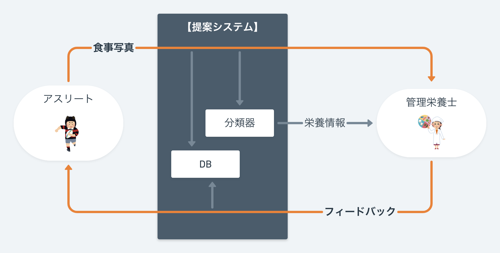
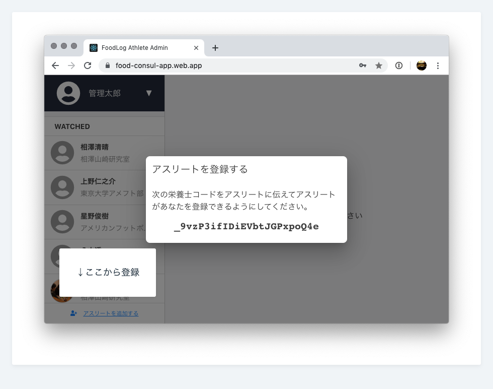
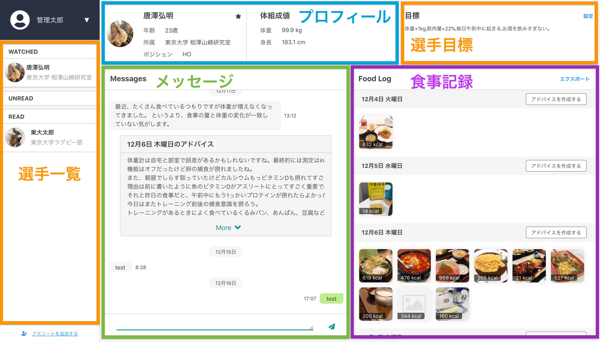
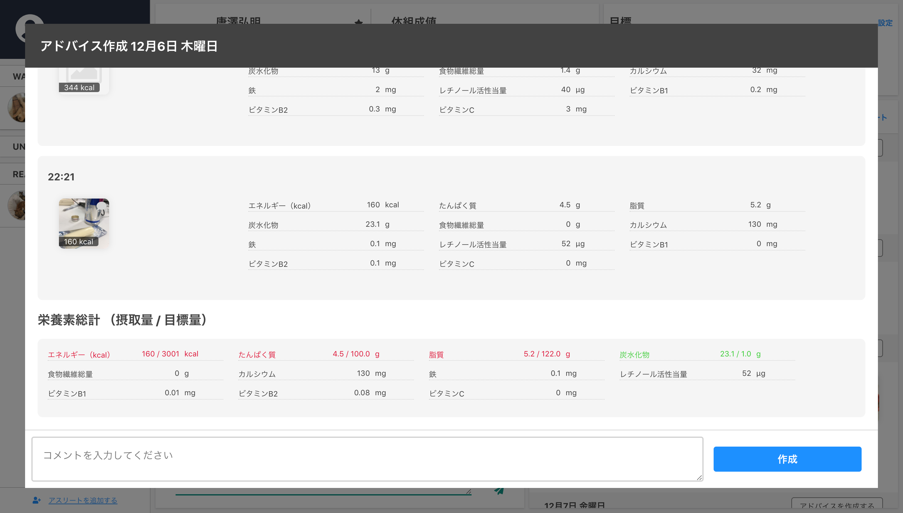
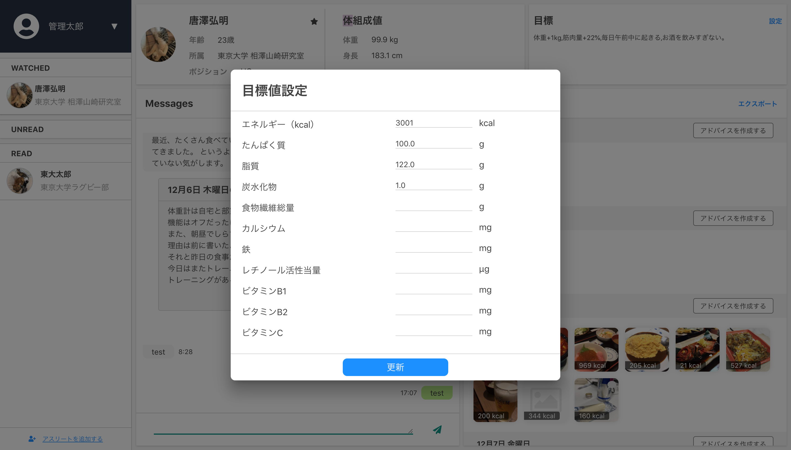

# FoodLog for Athletes v1.0.4

## FoodLog for Athletes とは

**FoodLog for Athletes** はアスリートと管理栄養士がコミュニケーションをとるためのアプリケーションです。
アスリートがこのアプリケーションを通じて食事の記録を取ることで、
管理栄養士は食事の記録と栄養素のレポートを受け取ることができます。

この文章では FoodLog for Athletes の機能を使用方法とともに説明します。

## 使用方法

### 1. 会員登録

下記の URL から Web サイトにアクセスし、アカウントを作成して下さい。

[https://food-consul-app.web.app/signup](https://food-consul-app.web.app/signup)

### 2. ログイン

下記の URL から Web サイトにアクセスし、発行された ID とパスワードでログインしてください。

[https://food-consul-app.web.com/auth](https://food-consul-app.web.com/)

### 3. 選手登録

このサービスでは管理栄養士がアスリートを登録することで初めてその選手に対する栄養指導ができるようになります。
選手登録はログイン後の画面の左下にある「アスリートを追加する」から行えます。

### 4. 全体画面

画面右側の選手一覧画面から選手をクリックすると選手ごとの情報を見ることができます。

### 5. アドバイス作成

選手画面の食事記録のパネルから日毎の「アドバイス作成」ボタンをクリックすることで、
日毎に摂取した食事と栄養素の量を見ることができます。

アドバイス作成画面では作成された時刻が近い食事がまとめられて表示されます。
また 1 日の摂取栄養量と目標栄養量が表示されます。

### 6. コメント作成

選手画面のメッセージパネルからは選手に向けてコメントを送ることができます。
コメントは選手に通知されます（選手が設定で許可した場合のみ）。

### 7. 栄養素目標値設定

選手画面の目標パネルの「設定」をクリックすることで先週に対して栄養素ごとの目標値を設定できます。

### 8. 選手ウォッチ機能

選手画面のプロフィールパネルで選手の名前のとなりに表示された星(★)をクリックすることで選手をウォッチできます。
これにより選手を選手一覧で発見しやすくなります。

## 目的

FoodLog for Athletes は東京大学工学部電子情報工学科相澤山崎研究室によって開発・運営されているサービスで、
食事記録の自動化が選手と管理栄養士双方の入力の手間が削減されることを目的としています。

## フィードバック

不具合・要望等がございましたらどんなに些細なことでもご報告してくださると大変助かります。

---

東京大学 工学部 電子情報工学科 相澤山崎研究室
EMAIL: foodlog-hal@hal.t.u-tokyo.ac.jp

---
